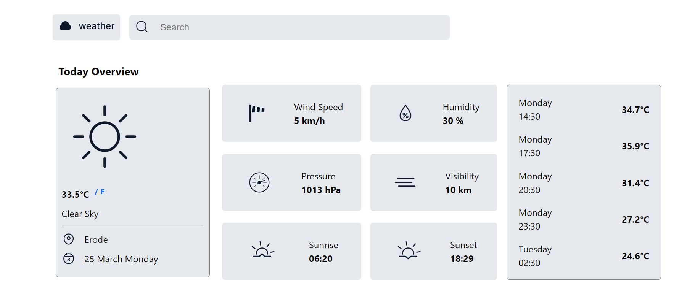

# Weather

Quickly access accurate weather information with a clean, modern and user-friendly design.

## Installation

Clone the repository and install dependencies using npm:

`npm install`

## Usage

Create a .env file and add the API keys.

`VITE_APP_WEATHER_API_KEY='8fd2635d5361783a7d2a28913458efd1'`
`VITE_APP_WEATHER_API_URL='https://api.openweathermap.org/data/2.5'`

Start the development server:

`npm run dev`

This will open the app in your default browser.

Build the app for production:

`npm run build`

Preview the production build:

`npm run preview`

